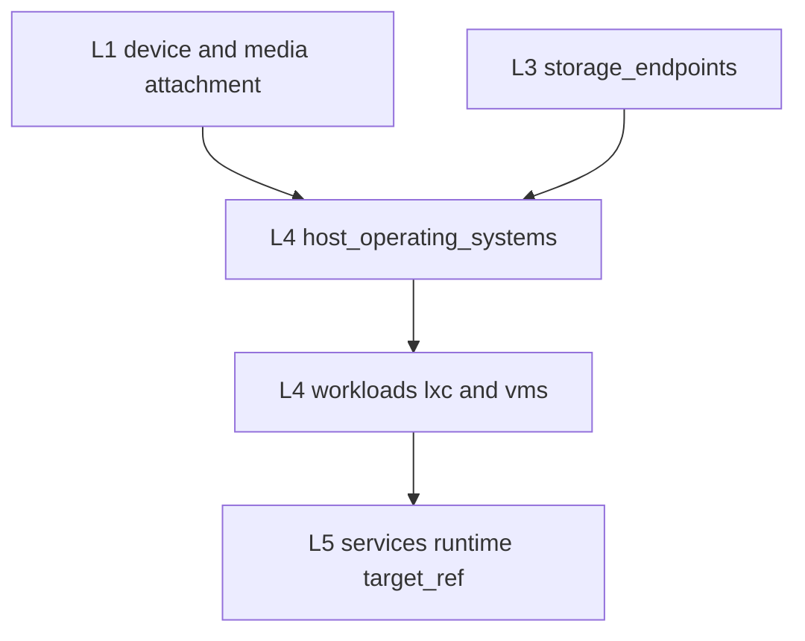

# ADR 0035: L4 Host OS Foundation and Runtime Substrate Contracts

- Status: Proposed
- Date: 2026-02-22

## TL;DR

| Aspect | Value |
|---|---|
| Scope | Make `host_operating_systems` a first-class, validated L4 contract |
| Problem | Host OS facts are authored, but schema/validators do not enforce them |
| Public API | `host_operating_systems[].id`, `lxc[].id`, `vms[].id` (after VM schema typing) |
| L1 prerequisite | `class: compute` must declare `specs.cpu.architecture` |
| Breaking changes | None in phase-1 (additive) |
| Main risk | Partial adoption without capability and reference guardrails |

## Context

`L4_platform` now contains `host_operating_systems` in composition root and module files, for example:

- `topology/L4-platform.yaml`
- `topology/L4-platform/host-operating-systems/hos-orangepi5-ubuntu.yaml`

Current contract gap:

1. `host_operating_systems` is present in topology data but not typed in `topology-v4-schema.json`.
2. ID collector and reference checks do not validate host OS objects.
3. `L5` runtimes already target devices with container and baremetal modes, but some runtime-bearing devices do not yet have `hos-*` objects.
4. VM list is schema-weak (`vms` array without typed `items`), which weakens claimed API stability.
5. Compute substrate compile target is not enforced in L1 today, so host/runtime architecture compatibility can drift.

Cross-layer dependency direction for this decision:

| Direction | Contract |
|---|---|
| L4 host OS -> L1 | `device_ref`, `installation.media_ref`, `installation.slot_ref`, `specs.cpu.architecture` (compile target) |
| L4 host OS -> L3 | Optional `installation.root_storage_endpoint_ref` |
| L4 workloads -> L1/L2/L3 | Existing `device_ref`, `bridge_ref`, `network_ref`, `storage_endpoint_ref`, `data_asset_ref` |
| L5 services -> L4/L1 | Existing `runtime.target_ref` model stays unchanged |

Cross-layer contract diagram:

## Alternatives Considered

| Option | Decision | Reason |
|---|---|---|
| A. Keep host OS as documentation-only YAML | Rejected | No machine-checked guarantees, drift risk grows |
| B. Move host OS inventory to L1 | Rejected | OS lifecycle is runtime/platform state, not physical underlay fact |
| C. Invert dependency and make L2 depend on L4 | Rejected | Creates cyclic semantics and breaks strict downward-layer model |
| D. Keep layer order, formalize host OS in L4 | Selected | Preserves existing architecture and adds enforceable runtime foundation |

## Decision

### D0. L1 compute architecture is an explicit taxonomy contract

For every `L1` device with `class: compute`, `specs.cpu.architecture` is required.

Purpose:

1. Declare host compile/runtime target explicitly (`x86_64`, `arm64`, and accepted aliases).
2. Prevent accidental placement assumptions for architecture-sensitive workloads and images.
3. Keep host substrate compatibility checks deterministic for L4/L5 validations.

### D1. Host OS is a first-class L4 entity

Add typed schema support for `L4_platform.host_operating_systems[]` with stable ID pattern `hos-*`.

Minimum contract in v1:

- `id`
- `device_ref`
- `distribution`
- `architecture` (must match normalized `L1 specs.cpu.architecture`)
- `host_type` (`baremetal`, `hypervisor`, `embedded`)
- `status`
- `capabilities[]` (for example `lxc`, `vm`, `docker`, `container`, `cloudinit`)
- `installation.media_ref` (optional when unknown)
- `installation.slot_ref` (optional when unknown)
- `installation.root_storage_endpoint_ref` (optional `L3 storage_endpoint_ref` when root placement is modeled)

### D2. Separate host OS from guest OS explicitly

L4 keeps two different OS concerns:

- Host OS lifecycle:
  - `host_operating_systems[]`
  - Example host types:
    - Ubuntu on OrangePi5 NVMe (`baremetal`)
    - Proxmox VE on `gamayun` (`hypervisor`)
    - RouterOS on `mikrotik-chateau` (`embedded`)
- Guest OS/runtime image intent:
  - `lxc[].os`, `vms[].os`, template image metadata

This keeps platform substrate facts (`host`) separate from workload image semantics (`guest`).

### D3. Keep substrate and workload split explicit inside L4

Logical L4 model is:

- `substrates`: runtime foundations (`host_operating_systems`, future `container_runtimes`)
- `workloads`: runtime instances (`lxc`, `vms`)

In current MVP structure this is represented by separate top-level keys and directories, without additional nesting changes.

### D4. Keep runtime references backward-compatible in phase-1

No immediate breaking changes to existing runtime contracts:

- LXC/VM remain referenced by `lxc[].id` and `vms[].id`.
- L5 runtime keeps `runtime.target_ref`.

Add optional extension field in phase-1 schema:

- `lxc[].host_os_ref` (optional)
- `vms[].host_os_ref` (optional)

Validation behavior:

1. If `host_os_ref` exists, it must resolve to existing `host_operating_systems[].id`.
2. If both `host_os_ref` and `device_ref` exist, referenced host OS must belong to the same `device_ref`.
3. If a workload has `device_ref` and device has exactly one active host OS, omission of `host_os_ref` is allowed (warning-free).
4. If a workload has `device_ref` and device has multiple active host OS objects, missing `host_os_ref` is a warning in phase-1 and an error in phase-2.

### D5. Enforce runtime capability checks against host OS

Add phase-2 validator rules:

| Runtime or workload | Required host capability |
|---|---|
| `service.runtime.type: lxc` | `lxc` |
| `service.runtime.type: vm` | `vm` |
| `service.runtime.type: docker` | `docker` or `container` |
| `service.runtime.type: baremetal` | Host OS object exists for `target_ref` |
| `L4 vms[]` placement | `vm` on resolved host OS |
| `L4 lxc[]` placement | `lxc` on resolved host OS |
| `L4 template.architecture` (if set) | Must match resolved host OS architecture |

Architecture normalization for compatibility checks:

- `amd64` -> `x86_64`
- `aarch64`, `ARM64` -> `arm64`
- `riscv` -> `riscv64`
- `x86` -> `i386`

Validator rule:

- `host_operating_systems[].architecture` must match normalized `L1 device.specs.cpu.architecture`.

When `template_ref` and explicit guest OS fields conflict, precedence rule is:

1. Workload explicit OS field wins.
2. Template OS is fallback/default.
3. Validator emits warning on conflicting values.

### D6. Do not change layer dependency order

Layer model remains:

- `L0 -> L1 -> L2 -> L3 -> L4 -> L5 -> L6 -> L7`

Provisioning sequence in real operations (install OS, then configure network) does not require reversing architectural dependency direction. L2 continues to define logical network contract consumed by L4 workloads.

## Public API Contract (L4 v1)

| Entity | Visibility | Stability | Consumers |
|---|---|---|---|
| `host_operating_systems[].id` (`hos-*`) | Public | Stable v1 | L4 validators, docs, L5 runtime chain validation |
| `lxc[].id` (`lxc-*`) | Public | Stable v1 | L5 runtime, L6, L7 |
| `vms[].id` (`vm-*`) | Public | Stable after phase-0 VM schema typing | L5 runtime, L6, L7 |
| `resource_profiles[]`, `templates.*`, `_defaults` | Internal | Mutable | L4 only |

Evolution policy:

1. Breaking changes to public IDs require a new ADR.
2. Deprecation window is one release cycle before removal.

## Migration Plan

### Phase-0: Contract Readiness

1. Add schema definition for `host_operating_systems`.
2. Type `vms` as `items: { "$ref": "#/definitions/Vm" }`.
3. Add L1 CPU architecture taxonomy in schema (`specs.cpu.architecture`) and enforce it for `class: compute` in validators.
4. Extend ID collector with `host_operating_systems`.
5. Add reference validators for `host_os_ref` consistency rules.
6. Add validator guardrail for template-vs-explicit OS conflicts.
7. Add template architecture compatibility checks (`template.architecture` vs resolved host architecture).

### Phase-0.5: Baseline Host OS Coverage

Create missing host OS substrate objects for active runtime devices:

1. `hos-gamayun-proxmox` (`host_type: hypervisor`, capabilities: `lxc`, `vm`, `cloudinit`)
2. `hos-mikrotik-chateau-routeros` (`host_type: embedded`, capabilities: `container`)

Goal: every active runtime-bearing device has at least one `hos-*` object.

### Phase-1: Additive Adoption

1. Keep all existing workload references valid.
2. Add `host_os_ref` only where ambiguity exists or where explicit substrate pinning is needed.
3. Add docs rendering for host OS inventory and workload-to-host-OS links when present.

### Phase-2: Strictness Upgrade

1. Promote missing `host_os_ref` to error only for ambiguous multi-OS-per-device cases.
2. Enforce `runtime/workload -> capability` mapping checks.
3. Keep single-host-OS-per-device omission valid to minimize authoring overhead.

## Blockers and Prerequisites

| Item | Status | Notes |
|---|---|---|
| `host_operating_systems` schema typing | Required | Phase-0 blocker |
| `vms` typed items schema | Required | Phase-0 blocker for stable VM API claim |
| L1 compute `specs.cpu.architecture` enforcement | Required | Phase-0 blocker for deterministic compile-target checks |
| `ids.py` hos ID collection | Required | Phase-0 blocker |
| Runtime capability validators | Required for phase-2 | Added as staged enforcement |
| Host OS data backfill (`gamayun`, `mikrotik-chateau`) | Required | Phase-0.5 blocker for full runtime-chain coverage |

## Rollback

If phase-0 or phase-1 introduces regressions:

1. Revert schema and validator changes for `host_operating_systems`.
2. Keep authored topology objects as inert data (no strict checks).
3. Run:
   - `python topology-tools/validate-topology.py --strict`
   - `python topology-tools/regenerate-all.py --topology topology.yaml --strict --skip-mermaid-validate`

## Toolchain Impact

| Component | Impact | Action |
|---|---|---|
| `topology-tools/schemas/topology-v4-schema.json` | High | Add typed `host_operating_systems`, typed `vms`, and typed `templates.*` with optional `architecture` |
| `topology-tools/scripts/validators/checks/foundation.py` | Medium | Enforce `specs.cpu.architecture` on `class: compute` devices |
| `topology-tools/scripts/validators/ids.py` | High | Collect `hos-*` IDs for chain validation |
| `topology-tools/scripts/validators/checks/references.py` | High | Add host OS reference, consistency, capability, and OS precedence checks |
| `topology-tools/scripts/generators/docs/generator.py` | Low | Render host OS inventory section and optional links |
| Terraform generators | None (phase-1) | Keep existing runtime generation path |

## Consequences

Benefits:

- Host OS facts become enforceable instead of informational.
- Clear host/guest OS separation reduces layer ambiguity.
- Extensibility for cloud nodes and mixed runtime substrates without changing L1/L2 contracts.

Trade-offs:

- Additional schema and validator complexity.
- More explicit references when devices have multiple host OS states.

Success metrics:

| Metric | Target |
|---|---|
| `L1 class: compute` devices with `specs.cpu.architecture` | 100% |
| Host OS objects with valid `device_ref` | 100% |
| Host OS objects per active runtime device | 100% |
| `L5` services with runtime type `baremetal`/`docker` resolving valid host OS chain | 100% |
| Invalid `host_os_ref` accepted in strict mode | 0 |
| Cross-layer reference cycles introduced | 0 |
| Workload breakage after phase-1 rollout | 0 |
| Docs show host OS inventory deterministically | 100% |

## Ownership (RACI)

| Role | Party |
|---|---|
| Responsible | Topology maintainer |
| Accountable | Architecture owner |
| Consulted | L5/L6/L7 maintainers |
| Informed | Operations owner |

## References

- `topology/L4-platform.yaml`
- `topology/L1-foundation/devices/owned/compute/gamayun.yaml`
- `topology/L4-platform/host-operating-systems/hos-orangepi5-ubuntu.yaml`
- `topology-tools/schemas/topology-v4-schema.json`
- `topology-tools/scripts/validators/checks/foundation.py`
- `topology-tools/scripts/validators/ids.py`
- `topology-tools/scripts/validators/checks/references.py`
- `topology/L5-application/services.yaml`
- `topology/MODULAR-GUIDE.md`
- [0032](0032-l3-data-modularization-and-layer-contracts.md)
- [0034](0034-l4-platform-modularization-and-runtime-taxonomy.md)
