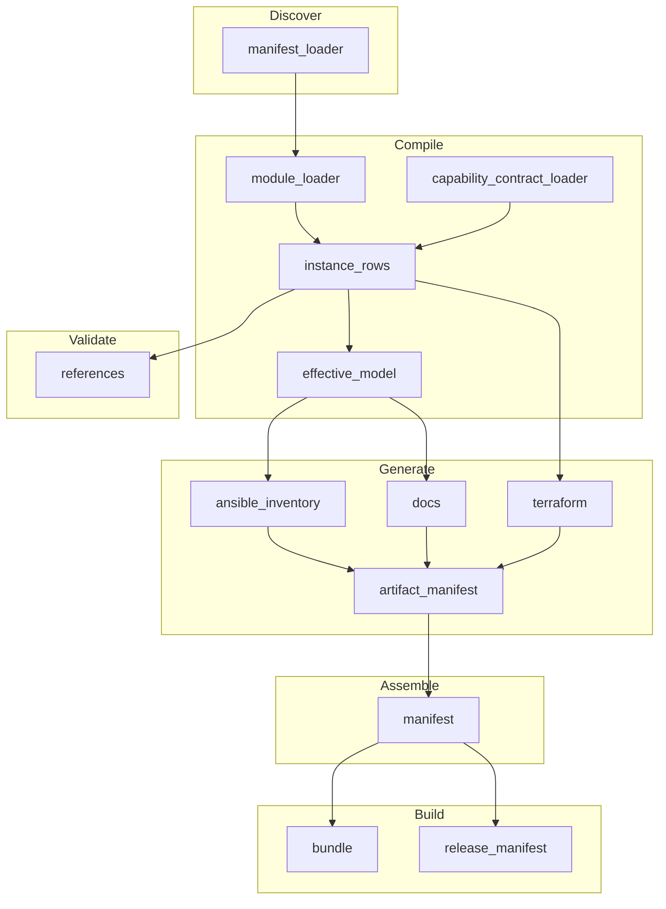

# Plugin Dependency Review

**Date:** 2026-05-29
**Source:** Phase 3 Plugin System Development Plan (P3.3)
**Purpose:** Document architectural rationale for high fan-in plugins and optimization opportunities

---

## Executive Summary

The plugin system has a clear critical path with one dominant hub:
- **base.compiler.instance_rows** (37 dependents) - Single most critical plugin
- Well-structured tier architecture with clear data flow
- No immediate optimization required, but monitoring recommended

---

## High Fan-In Plugins (Top 10)

| Rank | Plugin ID | Fan-In | Stage | Key Output |
|------|-----------|--------|-------|------------|
| 1 | base.compiler.instance_rows | 37 | compile | normalized_rows |
| 2 | base.compiler.effective_model | 6 | compile | effective_model_candidate |
| 3 | base.validator.references | 4 | validate | (validation only) |
| 4 | base.assembler.manifest | 4 | assemble | assembly_manifest_path |
| 5 | base.compiler.module_loader | 3 | compile | class_map, object_map |
| 6 | base.validator.generator_migration_status | 3 | validate | generator_migration_summary |
| 7 | base.generator.artifact_manifest | 3 | generate | artifact_manifest_path |
| 8 | base.discover.manifest_loader | 2 | discover | manifest_loader_summary |
| 9 | base.compiler.capability_contract_loader | 2 | compile | catalog_ids, packs_map |
| 10 | base.generator.ansible_inventory | 2 | generate | generated_dir |

---

## Detailed Analysis

### 1. base.compiler.instance_rows (Fan-In: 37)

**Metrics:**
- Direct dependents: 37
- Transitive dependents: ~50+
- Critical path position: **YES** (bottleneck)

**Rationale:**
This plugin is the canonical data transformation hub. It converts raw topology instances into normalized row format that all downstream plugins consume. High fan-in is intentional and architecturally correct.

**Produces:**
```yaml
- key: normalized_rows
  scope: pipeline_shared
```

**Dependent Categories:**
| Category | Count | Examples |
|----------|-------|----------|
| Validators | 20+ | reference validators, contract validators |
| Generators | 10+ | terraform, ansible, docs, diagrams |
| Compilers | 5+ | effective_model, capabilities |

**Optimization Opportunities:**
1. **Partial Data Access:** Some consumers only need subset of rows
   - Could split into `normalized_rows.vms`, `normalized_rows.networks`, etc.
   - Risk: Increased complexity, more produces declarations
   - Recommendation: **Not recommended** - current single output is simpler

2. **Lazy Evaluation:** Compute rows on-demand
   - Risk: Non-deterministic execution order
   - Recommendation: **Not recommended** - breaks parallel execution model

3. **Caching:** Cache normalized_rows across incremental builds
   - Opportunity: Significant speedup for unchanged topologies
   - Recommendation: **Consider for Phase 4** (incremental compilation)

**Verdict:** No changes recommended. High fan-in is by design.

---

### 2. base.compiler.effective_model (Fan-In: 6)

**Metrics:**
- Direct dependents: 6
- Transitive dependents: ~15
- Critical path position: YES (compile stage exit gate)

**Rationale:**
Produces the authoritative compiled model consumed by all generators. Uses `compiled_json_owner: true` to ensure single ownership.

**Produces:**
```yaml
- key: effective_model_candidate
  scope: pipeline_shared
```

**Dependent Categories:**
| Category | Count | Examples |
|----------|-------|----------|
| Generators | 6 | ansible_inventory, docs, diagrams, docker_compose, topology_graph, effective_json |

**Optimization Opportunities:**
1. **Model Views:** Pre-compute specialized views (network-only, compute-only)
   - Benefit: Reduce downstream parsing overhead
   - Risk: Model divergence, maintenance burden
   - Recommendation: **Monitor** - implement if generators show bottleneck

**Verdict:** Healthy architecture. No changes needed.

---

### 3. base.validator.references (Fan-In: 4)

**Metrics:**
- Direct dependents: 4
- Transitive dependents: 4
- Critical path position: NO (validation only)

**Rationale:**
Reference validation must complete before dependent validators can assume references are resolved.

**Dependent Validators:**
- base.validator.embedded_in
- base.validator.ethernet_port_inventory
- base.validator.model_lock
- base.validator.router_ports

**Optimization Opportunities:**
1. **Parallel Validation:** Allow dependents to run in parallel after references pass
   - Already implemented via depends_on ordering
   - Recommendation: **No change**

**Verdict:** Appropriate fan-in for validation sequencing.

---

### 4. base.assembler.manifest (Fan-In: 4)

**Metrics:**
- Direct dependents: 4
- Critical path position: YES (assemble stage hub)

**Rationale:**
Assembly manifest is the index of all generated artifacts, required by all builders.

**Dependent Builders:**
- base.builder.deploy_bundle
- base.builder.bundle
- base.builder.release_manifest
- base.builder.sbom

**Optimization Opportunities:**
1. **Streaming Assembly:** Allow builders to start before full manifest
   - Risk: Incomplete manifests, race conditions
   - Recommendation: **Not recommended**

**Verdict:** Correct sequencing for build integrity.

---

## Dependency Graph Statistics

| Metric | Value |
|--------|-------|
| Total plugins | 85 |
| Plugins with dependents (fan-in > 0) | 41 (48%) |
| Plugins with no dependents (leaves) | 44 (52%) |
| Maximum fan-in | 37 |
| Average fan-in | 1.31 |
| Median fan-in | 0 |

### Fan-In Distribution

```
Fan-In    Count    Percentage
──────────────────────────────
0         44       52%
1         24       28%
2         7        8%
3         4        5%
4         3        4%
5         0        0%
6         1        1%
7-36      0        0%
37        1        1%
```

---

## Architecture Observations

### Strengths

1. **Clear Data Flow:** Discover → Compile → Validate → Generate → Assemble → Build
2. **Single Critical Hub:** `instance_rows` centralizes data transformation
3. **Appropriate Isolation:** Generators operate independently after effective_model
4. **No Circular Dependencies:** Graph is acyclic (verified by CI)

### Potential Concerns

1. **Single Point of Failure:** `instance_rows` failure blocks 37+ plugins
   - Mitigation: Comprehensive tests, high coverage
   - Status: **Acceptable risk** - intentional architecture

2. **Compile Stage Concentration:** 3 of top 10 are compilers
   - Observation: Compile stage is the transformation hub
   - Status: **By design** - matches ADR 0063

### Recommendations

| Priority | Action | Rationale |
|----------|--------|-----------|
| Low | Monitor instance_rows performance | Critical path bottleneck |
| Low | Consider row partitioning for Phase 4 | Incremental builds |
| None | No immediate refactoring | Architecture is sound |

---

## Appendix: Dependency Graph (Mermaid)



---

## Related Documents

- [ADR 0063: Plugin Microkernel](../../adr/0063-plugin-microkernel-for-compiler-validators-generators.md)
- [PLUGIN-NAMESPACE-CONVENTIONS.md](../guides/PLUGIN-NAMESPACE-CONVENTIONS.md)
- [PLUGIN-TEST-REQUIREMENTS.md](../guides/PLUGIN-TEST-REQUIREMENTS.md)
