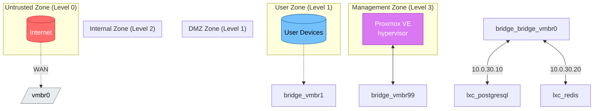

# Network Diagram

**Generated from**: topology.yaml v4.0.0
**Date**: 2026-02-17 18:56:35

---

## Infrastructure Network Topology

---

## Trust Zones Explanation

| Zone | Level | Purpose | Devices |
|------|-------|---------|---------|
| Untrusted | 0 | External networks (ISP, Internet, LTE) | None |
| User | 1 | End-user devices (WiFi, LAN, VPN clients) | None |
| Servers | 2 | Proxmox LXC and Orange Pi 5 services | postgresql-db, redis-cache |
| Iot | 1 | Smart home devices (isolated) | None |
| Guest | 0 | Guest WiFi (isolated, internet only) | None |
| Management | 3 | Infrastructure management (Proxmox UI, MikroTik UI) | None |

---

## Network Details

### net-wan

- **CIDR**: dhcp
- **Bridge**: None
- **Trust Zone**: untrusted
- **Gateway**: dhcp

---

### net-lte-failover

- **CIDR**: dhcp
- **Bridge**: None
- **Trust Zone**: untrusted
- **Gateway**: dhcp

---

### net-lan

- **CIDR**: 192.168.88.0/24
- **Bridge**: None
- **Trust Zone**: user
- **Gateway**: 192.168.88.1

**Allocated IPs**:
- `192.168.88.1` → mikrotik-chateau (bridge-lan)
- `192.168.88.2` → gamayun (eth0)
- `192.168.88.3` → orangepi5 (eth0)

---

### net-servers

- **CIDR**: 10.0.30.0/24
- **Bridge**: bridge-vmbr0
- **Trust Zone**: servers
- **Gateway**: 10.0.30.1
- **VLAN**: 30

**Allocated IPs**:
- `10.0.30.1` → mikrotik-chateau (vlan30)
- `10.0.30.2` → gamayun (vmbr0.30)
- `10.0.30.50` → orangepi5 (eth0.30)

---

### net-guest

- **CIDR**: 192.168.30.0/24
- **Bridge**: None
- **Trust Zone**: guest
- **Gateway**: 192.168.30.1
- **VLAN**: 50

**Allocated IPs**:
- `192.168.30.1` → mikrotik-chateau (vlan50-guest)

---

### net-iot

- **CIDR**: 192.168.40.0/24
- **Bridge**: None
- **Trust Zone**: iot
- **Gateway**: 192.168.40.1
- **VLAN**: 40

**Allocated IPs**:
- `192.168.40.1` → mikrotik-chateau (vlan40-iot)

---

### net-management

- **CIDR**: 10.0.99.0/24
- **Bridge**: bridge-vmbr0
- **Trust Zone**: management
- **Gateway**: 10.0.99.1
- **VLAN**: 99

**Allocated IPs**:
- `10.0.99.1` → mikrotik-chateau (vlan99-mgmt)
- `10.0.99.2` → gamayun (vmbr0.99)
- `10.0.99.3` → orangepi5 (eth0.99)

---

### net-vpn-home

- **CIDR**: 10.0.200.0/24
- **Bridge**: None
- **Trust Zone**: user
- **Gateway**: 10.0.200.1

**Allocated IPs**:
- `10.0.200.1` → mikrotik-chateau (wireguard1)

---

### net-tailscale

- **CIDR**: 100.64.0.0/10
- **Bridge**: None
- **Trust Zone**: user

---

---

**DO NOT EDIT MANUALLY** - Regenerate with `python3 scripts/generate-docs.py`