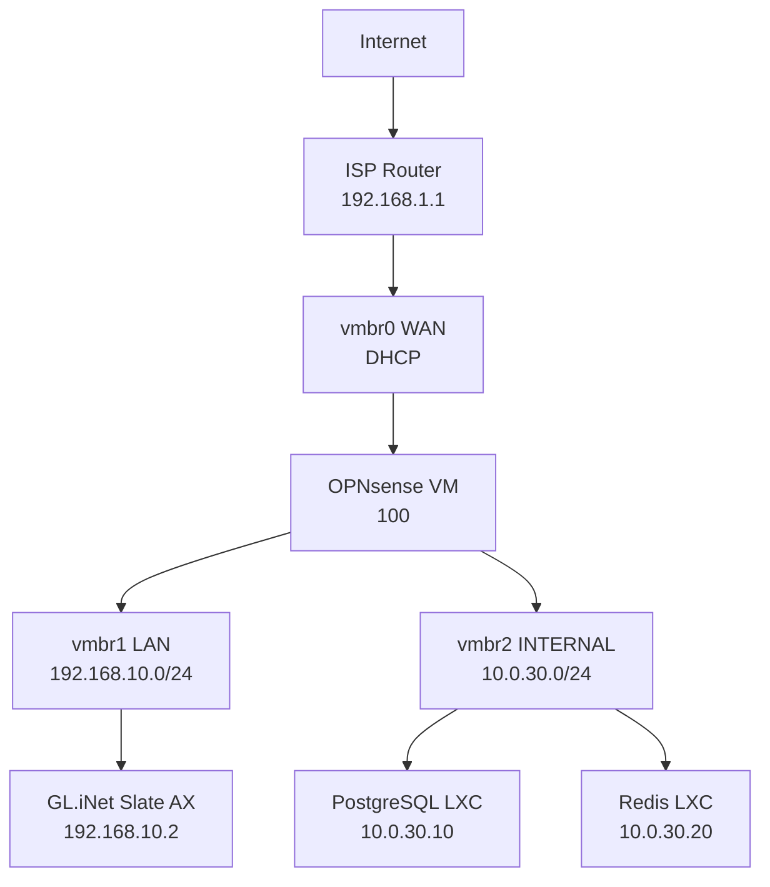

# Infrastructure Generator Scripts

These Python scripts transform `topology.yaml` into Terraform configs, Ansible inventory, and documentation.

## Overview

**Single Source of Truth**: `topology.yaml`

**Generated Artifacts**:
- Terraform configurations (infrastructure)
- Ansible inventory (hosts and variables)
- Network diagrams (Mermaid)
- IP allocation tables (Markdown)
- Service inventory (Markdown)

## Scripts

### validate-topology.py

**Purpose**: Validate topology.yaml schema and consistency

**Usage**:
```bash
python3 scripts/validate-topology.py
```

**Checks**:
- YAML syntax valid
- Required fields present
- No IP address conflicts
- VMID uniqueness
- Network CIDR overlaps
- Storage references exist
- Bridge references valid

**Exit codes**:
- 0: Valid
- 1: Validation errors (prints errors to stderr)

---

### generate-terraform.py

**Purpose**: Generate Terraform configurations from topology.yaml

**Usage**:
```bash
python3 scripts/generate-terraform.py [--output terraform/]
```

**Generates**:
```
terraform/
├── generated-networks.tf       # Network bridges
├── generated-storage.tf        # Storage pools
├── generated-vms.tf            # Virtual machines
├── generated-lxc.tf            # LXC containers
└── generated-variables.tf      # Variables from topology
```

**Template**:
```hcl
# Generated from topology.yaml - DO NOT EDIT MANUALLY
# Regenerate with: python3 scripts/generate-terraform.py

resource "proxmox_virtual_environment_network_linux_bridge" "vmbr0" {
  node_name = var.proxmox_node_name
  name      = "vmbr0"
  comment   = "WAN Bridge - to ISP Router (USB-Ethernet)"
  ports     = ["eth-usb"]
  address   = ""  # DHCP
  autostart = true
}

resource "proxmox_virtual_environment_vm" "opnsense" {
  vm_id       = 100
  name        = "opnsense-fw"
  description = "OPNsense Firewall"
  # ... more config from topology.yaml
}
```

**Features**:
- Add header warning "DO NOT EDIT MANUALLY"
- Use topology metadata for comments
- Generate cloud-init snippets for LXC
- Reference storage/bridge names from topology

---

### generate-ansible-inventory.py

**Purpose**: Generate Ansible inventory and variables from topology.yaml

**Usage**:
```bash
python3 scripts/generate-ansible-inventory.py [--output ansible/inventory/production/]
```

**Generates**:
```
ansible/inventory/production/
├── hosts.yml               # Generated inventory
└── group_vars/
    └── all.yml            # Generated network variables
```

**hosts.yml format**:
```yaml
# Generated from topology.yaml - DO NOT EDIT MANUALLY
# Regenerate with: python3 scripts/generate-ansible-inventory.py

all:
  children:
    proxmox:
      hosts:
        pve-xps:
          ansible_host: 10.0.99.1
          ansible_user: root

    vms:
      hosts:
        opnsense-fw:
          ansible_host: 10.0.99.10
          ansible_user: root
          vmid: 100

    lxc:
      hosts:
        postgresql-db:
          ansible_host: 10.0.30.10
          ansible_user: postgres
          vmid: 200

        redis-cache:
          ansible_host: 10.0.30.20
          ansible_user: redis
          vmid: 201
```

**group_vars/all.yml format**:
```yaml
# Generated from topology.yaml - DO NOT EDIT MANUALLY

# Network definitions
networks:
  wan:
    cidr: "192.168.1.0/24"
    gateway: "192.168.1.1"
  opnsense_lan:
    cidr: "192.168.10.0/24"
    gateway: "192.168.10.1"
  lxc_internal:
    cidr: "10.0.30.0/24"
    gateway: "10.0.30.254"

# Service endpoints
postgresql_host: "10.0.30.10"
redis_host: "10.0.30.20"
nextcloud_host: "10.0.30.30"
```

---

### generate-docs.py

**Purpose**: Generate documentation from topology.yaml

**Usage**:
```bash
python3 scripts/generate-docs.py [--output docs/]
```

**Generates**:
```
docs/
├── network-diagram.md          # Mermaid diagram
├── ip-allocation.md            # IP address table
└── services.md                 # Service inventory
```

**network-diagram.md** (Mermaid):
```markdown
# Network Diagram


\`\`\`
```

**ip-allocation.md**:
```markdown
# IP Address Allocation

## Network: 192.168.10.0/24 (OPNsense LAN)

| IP | Hostname | Type | Description |
|----|----------|------|-------------|
| 192.168.10.1 | opnsense-fw | VM | OPNsense LAN interface |
| 192.168.10.2 | slate-ax | Router | GL.iNet Slate AX WAN |
| 192.168.10.254 | pve-xps | Bridge | Proxmox vmbr1 |

## Network: 10.0.30.0/24 (LXC Internal)

| IP | Hostname | Type | Description |
|----|----------|------|-------------|
| 10.0.30.1 | pve-xps | Bridge | Proxmox vmbr2 |
| 10.0.30.10 | postgresql-db | LXC 200 | PostgreSQL Database |
| 10.0.30.20 | redis-cache | LXC 201 | Redis Cache |
| 10.0.30.254 | opnsense-fw | Gateway | OPNsense INTERNAL |
```

**services.md**:
```markdown
# Service Inventory

## Infrastructure Services

### Proxmox Web UI
- **Location**: Proxmox Host
- **IP**: 10.0.99.1:8006
- **Protocol**: HTTPS
- **Description**: Proxmox management interface

### OPNsense Web UI
- **Location**: OPNsense VM (100)
- **IP**: 10.0.99.10:443
- **Protocol**: HTTPS
- **Description**: Firewall management

## Application Services

### PostgreSQL Database
- **Location**: LXC 200
- **IP**: 10.0.30.10:5432
- **Protocol**: TCP
- **Description**: PostgreSQL database server
- **Ansible Playbook**: postgresql.yml
```

---

### regenerate-all.py

**Purpose**: Regenerate all artifacts from topology.yaml

**Usage**:
```bash
python3 scripts/regenerate-all.py
```

**Executes**:
1. Validate topology
2. Generate Terraform
3. Generate Ansible inventory
4. Generate documentation

**Exit codes**:
- 0: Success
- 1: Validation failed (stops before generation)
- 2: Generation failed

---

## Implementation Guidelines

### Dependencies

```bash
pip install pyyaml jinja2 jsonschema
```

### Code Structure

```python
#!/usr/bin/env python3
"""
Generate Terraform from topology.yaml
"""
import yaml
from pathlib import Path
from jinja2 import Environment, FileSystemLoader

def load_topology(path="topology.yaml"):
    """Load and parse topology.yaml"""
    with open(path) as f:
        return yaml.safe_load(f)

def generate_terraform(topology, output_dir="terraform"):
    """Generate Terraform configs from topology"""
    env = Environment(loader=FileSystemLoader("scripts/templates"))

    # Generate networks
    template = env.get_template("networks.tf.j2")
    output = template.render(bridges=topology['bridges'])

    Path(f"{output_dir}/generated-networks.tf").write_text(output)

    # Generate VMs, LXC, etc.
    # ...

if __name__ == "__main__":
    topology = load_topology()
    generate_terraform(topology)
    print("✓ Terraform generated successfully")
```

### Jinja2 Templates

Store in `scripts/templates/`:
- `networks.tf.j2`
- `vms.tf.j2`
- `lxc.tf.j2`
- `inventory.yml.j2`
- `network-diagram.md.j2`

### Validation Schema

```python
# scripts/schemas/topology-schema.json
{
  "$schema": "http://json-schema.org/draft-07/schema#",
  "type": "object",
  "required": ["metadata", "bridges", "networks", "storage"],
  "properties": {
    "metadata": {
      "type": "object",
      "required": ["lab_name", "hardware"]
    },
    "bridges": {
      "type": "object",
      "patternProperties": {
        "^vmbr[0-9]+$": {
          "type": "object",
          "required": ["comment", "ports"]
        }
      }
    }
    // ... more schema
  }
}
```

## Testing Generators

```bash
# Test validation
python3 scripts/validate-topology.py

# Test Terraform generation (dry run)
python3 scripts/generate-terraform.py --dry-run

# Test Ansible generation (dry run)
python3 scripts/generate-ansible-inventory.py --dry-run

# Test documentation generation
python3 scripts/generate-docs.py --output /tmp/docs-test

# Full regeneration test
python3 scripts/regenerate-all.py --dry-run
```

## CI/CD Integration

```yaml
# .github/workflows/validate-topology.yml
name: Validate Topology

on:
  pull_request:
    paths:
      - 'topology.yaml'

jobs:
  validate:
    runs-on: ubuntu-latest
    steps:
      - uses: actions/checkout@v3
      - uses: actions/setup-python@v4
        with:
          python-version: '3.11'
      - run: pip install pyyaml jsonschema
      - run: python3 scripts/validate-topology.py
      - run: python3 scripts/generate-terraform.py --dry-run
      - run: terraform -chdir=terraform validate
```

## Development Workflow

1. Edit `topology.yaml`
2. Run `python3 scripts/validate-topology.py`
3. Run `python3 scripts/regenerate-all.py`
4. Review generated files (git diff)
5. Test with `terraform plan` and `ansible-playbook --check`
6. Commit topology.yaml + generated files
7. Apply changes with Terraform/Ansible

## TODO

- [ ] Implement validate-topology.py
- [ ] Implement generate-terraform.py
- [ ] Implement generate-ansible-inventory.py
- [ ] Implement generate-docs.py
- [ ] Create Jinja2 templates
- [ ] Create JSON schema for validation
- [ ] Add unit tests for generators
- [ ] Add CI/CD validation workflow
